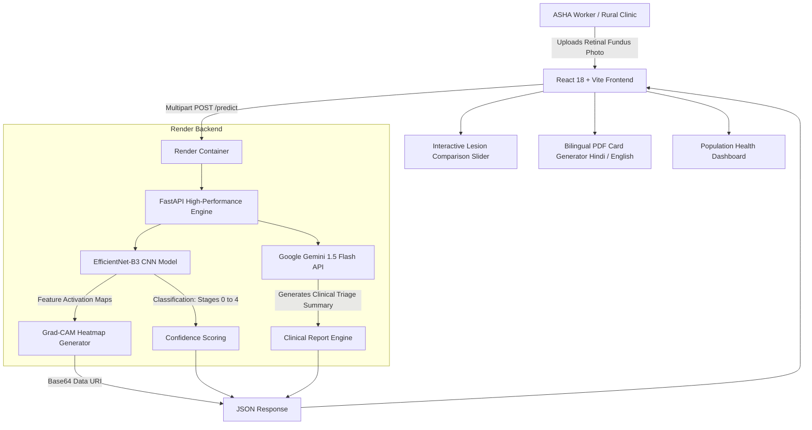

# DrishtiAI (दृष्टि AI) — Retinal Fundus Screening Platform

> **AI-Powered Diabetic Retinopathy Screening for Rural India**  
> **Hackathon**: Digital Campus on Google Cloud Hack Sprint — SSTC Bhilai  
> **Team**: NexGen | **Team Lead**: Syed Mahin Sabry  
> **Theme**: Healthcare | **Track**: AI & Cloud Innovation  

[](https://cloud.google.com/run)
[](https://ai.google.dev/)
[](https://pytorch.org/)
[](https://fastapi.tiangolo.com/)
[](https://react.dev/)
[](https://tailwindcss.com/)

---

## 📖 Table of Contents
- [Problem Statement](#-the-problem)
- [Our Solution](#-our-solution)
- [System Architecture](#-system-architecture)
- [Google Cloud Technologies](#-google-cloud-technologies-leveraged)
- [Key Features](#-key-features)
- [Repository Structure](#-repository-structure)
- [Quickstart Guide](#-quickstart-guide)
  - [Backend Setup](#1-backend-fastapi--pytorch)
  - [Frontend Setup](#2-frontend-react--vite)
- [Cloud Deployment Guide](#-cloud-deployment-google-cloud-run)
- [The Team](#-team-nexgen)

---

## 🚨 The Problem

* **77+ Million Diabetic Patients in India**: India has the second-highest diabetic population worldwide.
* **1 in 3 Develops Diabetic Retinopathy (DR)**: Unchecked microvascular damage to the retina causes irreversible visual impairment and blindness.
* **Specialist Scarcity**: India has only ~25,000 ophthalmologists for 1.4 billion people, with over 70% concentrated in metropolitan urban centers.
* **Rural Blind Spot**: Rural communities lack diagnostic infrastructure, and patients only seek medical care when vision loss is already permanent.

---

## 💡 Our Solution

**DrishtiAI** bridges the specialist gap by empowering frontline **ASHA (Accredited Social Health Activist) workers** at Primary Health Sub-Centres (PHCs) with an AI-guided screening tablet/kiosk:

1. **Portable Fundus Imaging**: ASHA worker captures a fundus photo using low-cost smartphone fundus attachments (e.g., Remidio, Forus 3nethra).
2. **EfficientNet-B3 Deep Learning**: Classifies the scan across the 5 standard International Clinical Diabetic Retinopathy (ICDR) stages.
3. **Explainable AI (Grad-CAM)**: Overlays high-resolution activation heatmaps directly onto retinal vessels to localize hemorrhages, hard exudates, and microaneurysms.
4. **Google Gemini 1.5 Flash Clinical Summaries**: Generates an empathetic, actionable 3-paragraph clinical report translated for rural health workers and patients.
5. **Bilingual Clinical Triage Cards**: Produces instant downloadable PDF clinical cards in English and Hindi (with authentic Devanagari typography).

---

## 🏗️ System Architecture



---

## ☁️ Cloud & AI Technologies Leveraged

* **Vercel**: High-performance edge deployment for our React 18 frontend, ensuring fast loading speeds even in low-bandwidth rural locations.
* **Render**: Containerized, cloud-hosted deployment for our FastAPI and PyTorch deep learning backend, providing automated builds and robust inference.
* **Google Gemini 1.5 Flash**: Rapid multimodal generative AI engine used to synthesize complex ophthalmology findings into 3 actionable sections (Findings, Urgency Level & Referral Window, Lifestyle Advice).
* **Offline-Resilient Local State Architecture**: To guarantee zero downtime and bypass API rate limits, the platform relies on a robust local-storage persistence model for ASHA worker authentication and patient history, removing dependencies on live Firebase limits.

---

## ✨ Key Features

| Feature | Description |
| :--- | :--- |
| **5-Stage ICDR Classification** | Stage 0 (No DR), Stage 1 (Mild), Stage 2 (Moderate), Stage 3 (Severe), Stage 4 (Proliferative DR). |
| **Explainable AI (Grad-CAM)** | Transparent AI that highlights *why* a classification was made by localizing retinal vascular abnormalities. |
| **Generative Clinical Reports** | Powered by Gemini 1.5 Flash with structured recommendations and referral urgency timelines. |
| **Offline-Resilient Architecture** | Graceful fallback templates and in-memory caching to guarantee zero clinic downtime in rural areas. |
| **Bilingual Patient Card** | Full Hindi & English PDF export with embedded fundus images, severity badge, and QR reference. |
| **ASHA Worker Profiles** | Role-tailored access portal with field presets (Sunita Devi, Priya Sharma) and custom screener options. |

---

## 📁 Repository Structure

```
Drishtiai/
├── backend/                        # FastAPI Backend & Deep Learning Services
│   ├── main.py                     # API routing, CORS, and request orchestration
│   ├── model.py                    # EfficientNet-B3 model definition & weights loader
│   ├── gradcam.py                  # PyTorch Grad-CAM explainability engine
│   ├── gemini_client.py            # Google Gemini 1.5 Flash integration & fallback templates
│   ├── firebase_client.py          # Firestore database integration & mock cache
│   ├── test_api.py                 # Automated unit and integration smoke tests
│   ├── efficientnet_dr.pth         # Trained deep learning model checkpoint
│   ├── Dockerfile                  # Production container specification for Cloud Run
│   ├── requirements.txt            # Python dependencies (Torch, FastAPI, Pillow)
│   ├── .env.example                # Backend environment configuration template
│   └── README.md                   # Backend technical documentation
│
├── frontend/                       # React 18 + Vite + Tailwind CSS Application
│   ├── src/
│   │   ├── components/             # Reusable UI widgets (Grad-CAM viewer, Navbar, Profile)
│   │   ├── context/                # AuthContext, ToastContext, LanguageContext
│   │   ├── pages/                  # LoginPage, UploadPage, ResultPage, DashboardPage
│   │   ├── utils/                  # Bilingual PDF generator (jsPDF + Devanagari font)
│   │   ├── api.js                  # Axios client communicating with Cloud Run backend
│   │   └── firebase.js             # Firebase client SDK initialization
│   ├── public/                     # Static assets and fundus camera presets
│   ├── package.json                # Frontend dependencies
│   ├── vite.config.js              # Vite bundler configuration
│   ├── tailwind.config.js          # Healthcare palette design tokens
│   ├── .env.example                # Frontend environment configuration template
│   └── README.md                   # Frontend UI documentation
│
├── .gitignore                      # Git exclusion rules (node_modules, secrets, caches)
└── README.md                       # Master Hackathon Documentation
```

---

## 🚀 Quickstart Guide

### Prerequisites
* **Python 3.10+**
* **Node.js 18+** & `npm`
* **Google Gemini API Key** ([Get one here](https://aistudio.google.com/))

---

### 1. Backend (FastAPI + PyTorch)

```bash
# 1. Navigate to backend directory
cd backend

# 2. (Optional) Create and activate virtual environment
python -m venv venv
venv\Scripts\activate       # On Windows
# source venv/bin/activate  # On Linux/macOS

# 3. Install backend dependencies
pip install -r requirements.txt

# 4. Configure environment variables
copy .env.example .env      # On Windows
# cp .env.example .env      # On Linux/macOS
# Add your GEMINI_API_KEY inside .env

# 5. Start the FastAPI server
python -m uvicorn main:app --reload --host 127.0.0.1 --port 8080
```
API Documentation will be available at: **`http://127.0.0.1:8080/docs`**

---

### 2. Frontend (React + Vite)

```bash
# 1. Open a new terminal and navigate to frontend directory
cd frontend

# 2. Install dependencies
npm install

# 3. Configure environment variables
copy .env.example .env      # On Windows
# cp .env.example .env      # On Linux/macOS

# 4. Start Vite development server
npm run dev
```
Open **`http://localhost:3000`** in your browser.

---

## ☁️ Cloud Deployment (Render & Vercel)

### 1. Backend (Render)
1. Push your repository to GitHub.
2. Go to [Render](https://render.com) and create a new **Web Service**.
3. Connect your GitHub repository and set the Root Directory to `backend` (or just deploy from the root Dockerfile).
4. Add the Environment Variable `GEMINI_API_KEY` with your actual key.
5. Deploy! Once live, copy your `.onrender.com` URL.

### 2. Frontend (Vercel)
1. Go to [Vercel](https://vercel.com) and import your GitHub repository.
2. Set the Root Directory to `frontend`.
3. Add an Environment Variable: `VITE_API_URL` = `<your-render-backend-url>`.
4. Deploy! Your app will be live with a `.vercel.app` domain.

---

## 👥 Team NexGen

* **Syed Mahin Sabry** (Team Lead & Full-Stack / Cloud Architecture)
* **Team NexGen** — SSTC Bhilai

*Developed for the Digital Campus on Google Cloud Hack Sprint 2026.*
